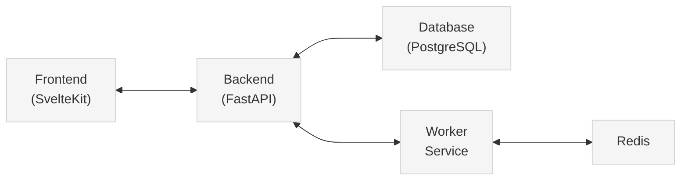
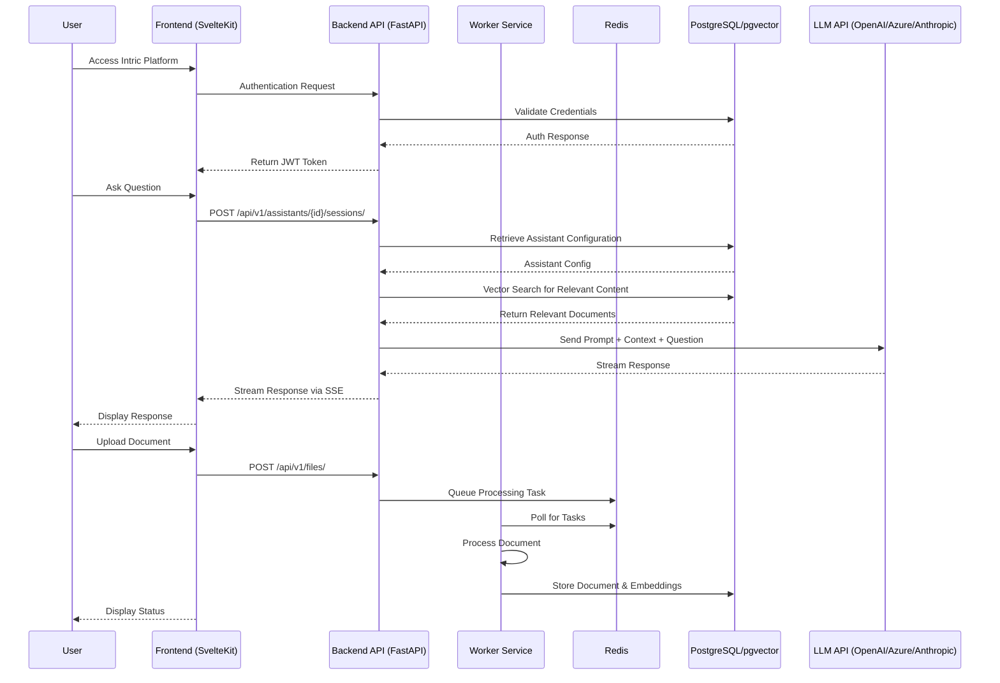

# Intric Platform

<div align="center">


**An open-source AI-powered knowledge management platform for the public sector**

[](https://opensource.org/licenses/MIT)
[](https://github.com/cagritest123/intric-release)
[](docs/contributing.md)

[Features](#features) • [Quick Start](#quick-start) • [Documentation](docs/) • [Architecture](docs/architecture.md) • [Development](docs/development-guide.md) • [Configuration](docs/configuration.md) • [Deployment](docs/deployment-guide.md) • [Contributing](docs/contributing.md)

</div>

## 🌟 Overview

Intric is an open-source AI platform designed to provide equitable access to generative AI capabilities within public organizations. Developed by Sundsvalls municipality in Sweden, Intric empowers organizations to create, deploy, and manage AI-powered knowledge systems while maintaining full control over security, data, and algorithms.

### Why Intric?

- **Built for Public Sector Needs**: Created specifically for municipalities and public organizations
- **Technology Independence**: Use any AI service or language model that fits your security requirements
- **Control & Compliance**: Full control over security, data, and algorithms to meet regulatory requirements
- **Knowledge Integration**: Utilize your organization's internal data as a knowledge base for AI assistants
- **Open Collaboration**: Share AI applications between organizations through open source

## ✨ Features

- **AI Assistants**: Create chatbot-based AI assistants tailored to specific needs with customizable prompts
- **Knowledge Bases**: Build searchable knowledge repositories from websites, documents, and APIs using vector embeddings
- **Custom AI Services**: Develop specialized AI services for specific tasks
- **Collaboration**: Team workspaces for developing, testing, and managing AI applications
- **Multi-modal Capabilities**: Analyze images, transcribe audio, and process various data formats
- **Performance Analytics**: Monitor and analyze AI assistant performance
- **Flexible Integration**: Connect to various LLM providers (OpenAI, Azure, Anthropic)

<div align="center">

<p><i>The Intric platform interface showing various AI assistants</i></p>
</div>

## 🚀 Quick Start (Local Development)

### Prerequisites
- Python 3.10 or higher
- Node.js v20 or higher
- Docker
- Required system libraries: `libmagic1` and `ffmpeg`

```bash
# Install required system libraries (Ubuntu/Debian)
sudo apt-get install libmagic1 ffmpeg
```

Get Intric running locally in just a few minutes:

```bash
# 1. Clone the repository
git clone https://github.com/sundsvallai/intric.git
cd intric

# 2. Set up environment files
# For backend development
cp backend/.env.local.example backend/.env
# For frontend development
cp frontend/apps/web/.env.local.example frontend/apps/web/.env

# 3. Start infrastructure services (PostgreSQL and Redis)
cd backend
docker compose up -d

# 4. Install backend dependencies
# Install Poetry if not already installed
pip install poetry
poetry install

# 5. Initialize the database (first time only)
poetry run python init_db.py

# 6. Start the backend (in one terminal)
poetry run start
# Or alternatively:
poetry run uvicorn intric.server.main:app --reload --host 0.0.0.0 --port 8123

# 7. (Optional) Start the worker (in another terminal)
cd backend
poetry run arq src.intric.worker.arq.WorkerSettings

# 8. Install frontend dependencies (in another terminal)
cd ../frontend
# Install pnpm if not already installed
npm install -g pnpm@8.9.0
# Run setup script
pnpm run setup

# 9. Start the frontend
pnpm -w run dev
```

The application will be available at:
- Frontend: http://localhost:3000
- Backend API: http://localhost:8123

Login with:
- Email: user@example.com
- Password: Password1!

### Common Issues and Troubleshooting

- **Database Connection Issues**: Verify your backend `.env` file has the correct connection details for PostgreSQL and Redis, pointing to `localhost` with the correct ports.
- **Frontend Not Connecting to Backend**: Ensure your frontend environment file has `INTRIC_BACKEND_URL=http://localhost:8123`.

### Development Architecture

In the local development setup:
- Infrastructure services (PostgreSQL and Redis) run in Docker containers
- Application services (backend and frontend) run directly on your host machine
- This approach gives you fast hot reloading and easier debugging during development

For detailed development documentation, see the [Development Guide](docs/development-guide.md).

## 📋 Environment Configuration

Intric uses different environment files depending on your deployment scenario:

### Local Development Environment Variables

For local development, the backend `.env` file contains these important settings:

```
# API keys and model URLs
OPENAI_API_KEY=your_openai_key
ANTHROPIC_API_KEY=your_anthropic_key
AZURE_API_KEY=your_azure_key
AZURE_MODEL_DEPLOYMENT=
AZURE_ENDPOINT=
AZURE_API_VERSION=

# Infrastructure dependencies
POSTGRES_USER=postgres
POSTGRES_PASSWORD=postgres
POSTGRES_PORT=5432
POSTGRES_HOST=localhost
POSTGRES_DB=postgres
REDIS_HOST=localhost
REDIS_PORT=6379

# Security
JWT_SECRET=1234

# Feature flags
USING_ACCESS_MANAGEMENT=False
USING_AZURE_MODELS=False

# Log level
LOGLEVEL=DEBUG
```

For frontend, the `frontend/apps/web/.env` file should contain:

```
INTRIC_BACKEND_URL=http://localhost:8123
JWT_SECRET=1234
```

### Environment File Setup

- **Local Development**: 
  - The setup scripts will create these files automatically from templates
  - `backend/.env` - Used by the backend services
  - `frontend/apps/web/.env` - Used by the frontend dev server

- **Production Deployment**:
  - `/.env` in the project root directory
  - Set all required variables including `NEXUS_REGISTRY` to point to your registry

> **Note**: The `.env` files are not committed to the repository for security reasons. The Docker Compose files use the pattern `${VARIABLE_NAME:-default_value}` so variables will fall back to defaults if not set.

## 🌐 Production Deployment

### Prerequisites
- Linux server with Docker Engine 20.10.x or later
- Docker Compose 2.x or later
- Minimum 4GB RAM recommended (1GB minimum)
- Sufficient disk space for database storage (~50GB recommended)
- Outbound internet connectivity to LLM APIs (not required for on-prem deployment if you run models locally)

### Quick Deployment

```bash
# 1. Clone the repository
git clone https://github.com/cagritest123/intric-docs.git
cd intric-docs

# 2. Set up environment variables
cp .env.production.example .env
# Edit .env with your specific values

# 3. Pull the Docker images
docker compose pull

# 4. Start the services
docker compose up -d

# 5. Initialize the database (first time only)
docker compose --profile init up db-init
```

### Key Production Environment Variables

```
# Required
NEXUS_REGISTRY=your.nexus.registry.com
IMAGE_TAG=version_to_deploy
POSTGRES_PASSWORD=secure_password
JWT_SECRET=secure_random_string

# LLM API keys (at least one is required)
OPENAI_API_KEY=your_openai_key
ANTHROPIC_API_KEY=your_anthropic_key
AZURE_API_KEY=your_azure_key
```

For comprehensive deployment instructions, see the [Deployment Guide](docs/deployment-guide.md).

## 📚 Documentation

### Technology Stack

#### Backend
- **Language**: Python 3.10
- **Framework**: FastAPI
- **Database**: PostgreSQL 13 with pgvector for vector embeddings
- **Message Broker**: Redis
- **Task Queue**: ARQ (Redis-based)
- **Dependency Management**: Poetry
- **Architecture**: Domain-Driven Design (DDD)

#### Frontend
- **Framework**: SvelteKit
- **Package Manager**: pnpm
- **HTTP Client**: Fetch API with custom wrapper
- **Styling**: CSS/SCSS
- **State Management**: Svelte stores

#### Infrastructure
- **Containerization**: Docker
- **Orchestration**: Docker Compose
- **Static File Serving**: Nginx (can be replaced with other web servers)

## 🏗️ System Architecture

Intric follows a microservices architecture with several components working together:



### Component Interaction

<details>
<summary>Click to view detailed interaction diagram</summary>



</details>

## 👥 Community

Intric is developed as an open-source project by Sundsvalls municipality in Sweden. We're building a community of public sector organizations that share AI applications and experiences.

### Join the Conversation

To participate in the digital forum where municipalities can exchange experiences and questions, email [digitalisering@sundsvall.se](mailto:digitalisering@sundsvall.se) for an invitation.

### User Association (Planned)

Sundsvalls municipality is planning to establish a user association for Intric together with early adopters, similar to the experience with Open ePlatform. The association will:

- Coordinate work through an elected board
- Provide a digital forum for sharing experiences and solutions
- Host seminars demonstrating use cases and solutions
- Form working groups for specific development areas
- Actively share AI applications built on Intric

## 📜 License

Intric is released under the MIT License. See the [LICENSE](LICENSE) file for details.
