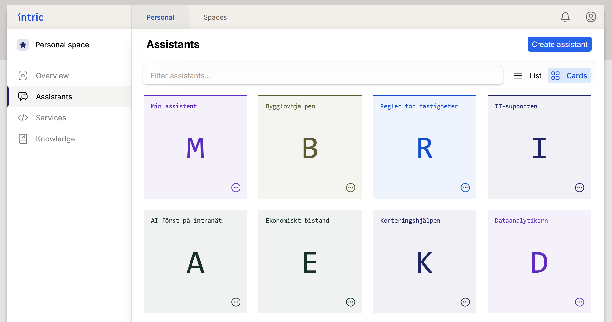
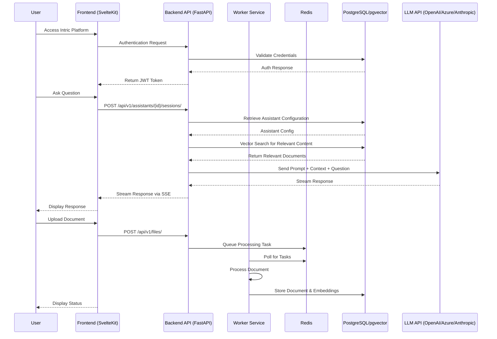

# Intric Platform

<div align="center">


**An open-source AI-powered knowledge management platform for the public sector**

[](https://opensource.org/licenses/MIT)
[](https://github.com/cagritest123/intric-docs)
[](docs/contributing.md)

[Features](#features) • [Quick Start](#quick-start) • [Documentation](docs/) • [Architecture](docs/architecture.md) • [Development](docs/development-guide.md) • [Deployment](docs/deployment-guide.md) • [Community](#community)

</div>

## 🌟 Overview

Intric is an open-source AI platform designed to provide equitable access to generative AI capabilities within public organizations. Developed by Sundsvalls municipality in Sweden, Intric empowers organizations to create, deploy, and manage AI-powered knowledge systems while maintaining full control over security, data, and algorithms.

### Why Intric?

- **Built for Public Sector Needs**: Created specifically for municipalities and public organizations
- **Technology Independence**: Use any AI service or language model that fits your security requirements
- **Control & Compliance**: Full control over security, data, and algorithms to meet regulatory requirements
- **Knowledge Integration**: Utilize your organization's internal data as a knowledge base for AI assistants
- **Open Collaboration**: Share AI applications between organizations through open source

## ✨ Features

- **AI Assistants**: Create chatbot-based AI assistants tailored to specific needs
- **Knowledge Bases**: Build searchable knowledge repositories from websites, documents, and APIs
- **Custom AI Services**: Develop specialized AI services for specific tasks
- **Collaboration**: Team workspaces for developing, testing, and managing AI applications
- **Multi-modal Capabilities**: Analyze images, transcribe audio, and process various data formats
- **Performance Analytics**: Monitor and analyze AI assistant performance
- **Flexible Integration**: Connect to various LLM providers (OpenAI, Azure, Anthropic)

<div align="center">

<p><i>The Intric platform interface showing various AI assistants</i></p>
</div>

## 🚀 Quick Start

The fastest way to deploy Intric in a production environment:

```bash
# 1. Clone the repository
git clone https://github.com/yourusername/intric.git
cd intric

# 2. Set up environment variables
cp .env.example .env
# Edit .env with your configuration

# 3. Start the services
docker-compose up -d

# 4. Initialize the database (first time only)
docker-compose --profile init up db-init

# 5. Access Intric at http://localhost:3000
```

For detailed installation instructions, see the [Deployment Guide](#production-deployment-guide).

## 📚 Documentation

### Technology Stack

#### Backend
- **Language**: Python 3.10
- **Framework**: FastAPI
- **Database**: PostgreSQL 13 with pgvector for vector embeddings
- **Message Broker**: Redis
- **Task Queue**: ARQ (Redis-based)
- **Dependency Management**: Poetry

#### Frontend
- **Framework**: SvelteKit
- **Package Manager**: pnpm
- **HTTP Client**: Axios/Fetch
- **Styling**: CSS/SCSS

#### Infrastructure
- **Containerization**: Docker
- **Orchestration**: Docker Compose
- **Web Server**: Nginx (for frontend)

## 🏗️ System Architecture

Intric follows a microservices architecture with several components working together:

```
┌─────────────┐     ┌─────────────┐     ┌─────────────┐
│   Frontend  │────▶│  Backend    │────▶│  Database   │
│   (Nginx)   │◀────│  (FastAPI)  │◀────│ (PostgreSQL)│
└─────────────┘     └─────────────┘     └─────────────┘
                         │  ▲
                         │  │
                         ▼  │
                    ┌─────────────┐     ┌─────────────┐
                    │   Worker    │────▶│    Redis    │
                    │             │◀────│             │
                    └─────────────┘     └─────────────┘
```

### Component Interaction

<details>
<summary>Click to view detailed interaction diagram</summary>



</details>

## 🧑‍💻 Development

### Development vs Production Configuration

This repository contains two different Docker Compose configurations:

1. **Root docker-compose.yml**: For **production deployment**
2. **backend/docker-compose.yml**: For **local development** (infrastructure services only)

### Local Development Setup

```bash
# Start infrastructure services (PostgreSQL and Redis)
cd backend
docker-compose up -d

# Install backend dependencies
poetry install

# Run backend services
poetry run uvicorn app.main:app --reload

# In another terminal, set up frontend
cd frontend
pnpm install
pnpm dev
```

For detailed development instructions, including project structure, testing, and contributing guidelines, see the [Development Guide](docs/DEVELOPMENT.md).

## 🌐 Production Deployment Guide

### Prerequisites
- Linux server with Docker Engine 20.10.x or later
- Docker Compose 2.x or later
- Minimum 4GB RAM recommended (1GB minimum)
- Sufficient disk space for database storage (~50GB recommended)
- Outbound internet connectivity to LLM APIs (not required for on-prem deployment)

### Quick Deployment

```bash
# 1. Clone the repository
git clone https://github.com/yourusername/intric.git
cd intric

# 2. Set up environment variables
cp .env.example .env
# Edit .env with your specific values

# 3. Pull the Docker images
docker-compose pull

# 4. Start the services
docker-compose up -d

# 5. Initialize the database (first time only)
docker-compose --profile init up db-init
```

For comprehensive deployment instructions, including all configuration options, Nexus registry setup, and troubleshooting, see the [Deployment Guide](docs/DEPLOYMENT.md).

### Key Environment Variables

The most important environment variables to configure:

```
# Required
NEXUS_REGISTRY=your.nexus.registry.com
IMAGE_TAG=version_to_deploy
POSTGRES_PASSWORD=secure_password
JWT_SECRET=secure_random_string

# LLM API keys (at least one is required)
OPENAI_API_KEY=your_openai_key
ANTHROPIC_API_KEY=your_anthropic_key
AZURE_API_KEY=your_azure_key
```

## 👥 Community

Intric is developed as an open-source project by Sundsvalls municipality in Sweden. We're building a community of public sector organizations that share AI applications and experiences.

### Join the Conversation

To participate in the digital forum where municipalities can exchange experiences and questions, email [digitalisering@sundsvall.se](mailto:digitalisering@sundsvall.se) for an invitation.

### User Association (Planned)

Sundsvalls municipality is planning to establish a user association for Intric together with early adopters, similar to the experience with Open ePlatform. The association will:

- Coordinate work through an elected board
- Provide a digital forum for sharing experiences and solutions
- Host seminars demonstrating use cases and solutions
- Form working groups for specific development areas
- Actively share AI applications built on Intric

## 📜 License

Intric is released under the MIT License. See the [LICENSE](LICENSE) file for details.
