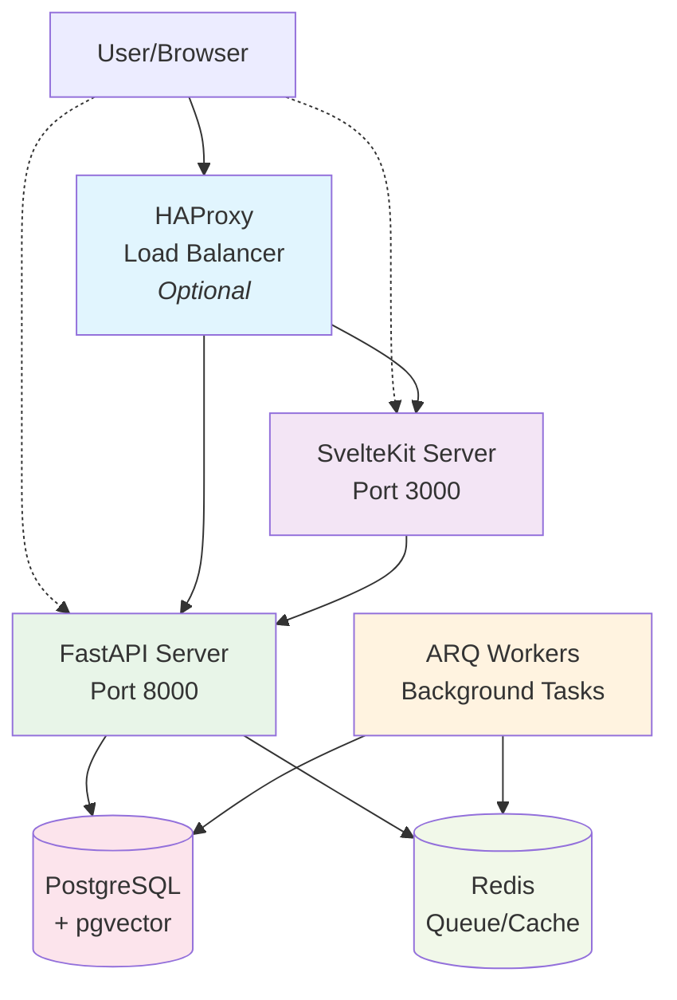

# Intric Community - Comprehensive Documentation

<div align="center">


**An open-source AI-powered knowledge management platform**

[](https://opensource.org/licenses/Apache-2.0)
[](https://github.com/intric-ai/intric-community)
[](old-docs-to-update/contributing.md)

[Features](#features) • [Quick Start](#quick-start) • [Documentation](#documentation) • [Architecture](#architecture) • [Development](#development) • [Deployment](#deployment) • [Contributing](#contributing)

</div>

## 🌟 Overview

Intric is an open-source AI platform that empowers organizations to create, deploy, and manage AI-powered knowledge systems while maintaining full control over security, data, and algorithms. Originally developed by Sundsvall municipality in Sweden, Intric provides equitable access to generative AI capabilities for public and private organizations.

### Why Intric?

- **Technology Independence**: Use any AI service or language model that fits your security requirements
- **Control & Compliance**: Full control over security, data, and algorithms to meet regulatory requirements
- **Knowledge Integration**: Utilize your organization's internal data as a knowledge base for AI assistants
- **Open Collaboration**: Share AI applications and experiences through open source
- **Production Ready**: Battle-tested in enterprise environments with HAProxy and RHEL8

## ✨ Features

### 🤖 AI Assistants
- Create chatbot-based AI assistants tailored to specific needs
- Customizable system prompts and behavior settings
- Multi-LLM support (OpenAI, Anthropic, Azure, OVHCloud, Mistral, VLLM)
- Assistant-specific API keys for programmatic access

### 📚 Knowledge Management
- **Document Processing**: PDF, Word, PowerPoint, text files with automatic chunking
- **Web Crawling**: Automated website content extraction with configurable limits
- **Vector Search**: Semantic search using PostgreSQL with pgvector
- **Real-time Processing**: Background tasks with ARQ queue system

### 👥 Team Collaboration
- **Workspaces (Spaces)**: Isolated environments for teams with role-based access
- **Multi-tenancy**: Owner, Admin, Editor, Viewer roles
- **Shared Resources**: Assistants, knowledge bases, and conversations
- **User Management**: Local authentication or OIDC integration

### 🔄 Real-time Features
- **Streaming Chat**: Server-Sent Events (SSE) for real-time response streaming
- **WebSocket Updates**: Live status updates for background tasks via Redis pub/sub
- **Background Processing**: Async document processing and web crawling

### 🔗 Integrations
- **Multiple LLM Providers**: OpenAI, Anthropic, Azure OpenAI, OVHCloud, Mistral, VLLM
- **Authentication**: Local auth with JWT, MobilityGuard OIDC, Zitadel support
- **Storage**: Local filesystem or cloud storage options
- **Vector Database**: PostgreSQL with pgvector extension for semantic search

<div align="center">

<p><i>The Intric platform interface showing various AI assistants</i></p>
</div>

## 🚀 Quick Start

### Option 1: Devcontainer (Recommended for Development)

The fastest way to get started is using the devcontainer:

1. **Prerequisites**: Docker and VS Code with Dev Containers extension
2. **Clone and Open**:
   ```bash
   git clone https://github.com/intric-ai/intric-community.git
   cd intric-community
   ```
3. **Open in VS Code** and click "Reopen in Container" when prompted
4. **Setup environment files**:
   ```bash
   cp backend/.env.template backend/.env
   cp frontend/apps/web/.env.example frontend/apps/web/.env
   # Edit the .env files with your settings (JWT_SECRET, API keys, etc.)
   ```
5. **Initialize database**: `cd backend && poetry run python init_db.py`
6. **Start services** in separate terminals:
   ```bash
   # Terminal 1: Backend
   cd backend && poetry run start
   
   # Terminal 2: Worker (optional)
   cd backend && poetry run arq src.intric.worker.arq.WorkerSettings
   
   # Terminal 3: Frontend
   cd frontend && pnpm -w run dev
   ```

### Option 2: Local Setup (5 Minutes)

**Prerequisites:**
- **Python 3.11+**
- **Node.js 18+**
- **pnpm 9.12.3**
- **Docker & Docker Compose**
- **System libraries**: `libmagic1` and `ffmpeg`

```bash
# Install required system libraries (Ubuntu/Debian)
sudo apt-get install libmagic1 ffmpeg
```

**Setup Steps:**

<details>
<summary>Click to view detailed setup commands</summary>

```bash
# 1. Clone the repository
git clone https://github.com/intric-ai/intric-community.git
cd intric-community

# 2. Set up environment files
cp backend/.env.template backend/.env
cp frontend/apps/web/.env.example frontend/apps/web/.env

# 3. Edit environment files (add your LLM API keys)
# Backend: Set JWT_SECRET, POSTGRES_PASSWORD, API keys
# Frontend: Set JWT_SECRET (must match backend), INTRIC_BACKEND_URL

# 4. Start infrastructure services (PostgreSQL with pgvector and Redis)
cd backend
docker compose up -d

# 5. Install and setup backend
poetry install
poetry run python init_db.py  # Creates database schema and default user

# 6. Start the backend API server (Terminal 1)
poetry run start  # Runs on port 8000

# 7. Start background worker (Terminal 2 - Optional but recommended)
poetry run arq src.intric.worker.arq.WorkerSettings

# 8. Install and setup frontend (Terminal 3)
cd ../frontend
pnpm install
pnpm run setup
pnpm -w run dev  # Runs on port 3000
```

</details>

### CI/CD Pipeline

The project includes a GitHub Actions workflow for automated builds:

- **Location**: `.github/workflows/build_and_push_images.yml`
- **Triggers**: Push to main branch, pull requests
- **Actions**: Build and push Docker images, run tests
- **Registry**: Configurable Docker registry for image storage

### Access the Application

- **Frontend**: http://localhost:3000
- **Backend API**: http://localhost:8000
- **API Documentation**: http://localhost:8000/docs
- **Default Login**: `user@example.com` / `Password1!`

### Troubleshooting Quick Start

- **Database Connection Issues**: Verify PostgreSQL is running: `docker compose ps db`
- **Frontend Not Loading**: Check `INTRIC_BACKEND_URL=http://localhost:8000` in frontend `.env`
- **Port Conflicts**: Check if ports 8000, 3000, 5432, 6379 are available
- **Authentication Issues**: Ensure `JWT_SECRET` matches between backend and frontend

## 📋 Environment Configuration

### Backend Environment Variables (.env)

<details>
<summary>Click to view complete backend environment configuration</summary>

```bash
# Database (PostgreSQL with pgvector)
POSTGRES_USER=postgres
POSTGRES_PASSWORD=postgres  # Change for production
POSTGRES_HOST=localhost
POSTGRES_PORT=5432
POSTGRES_DB=postgres

# Redis (Task queue and caching)
REDIS_HOST=localhost
REDIS_PORT=6379

# Security (REQUIRED)
JWT_SECRET=your-secure-secret-key  # Generate a secure key
JWT_AUDIENCE=intric
JWT_ISSUER=intric
API_KEY_HEADER_NAME=X-API-Key

# LLM Providers (at least one required)
OPENAI_API_KEY=sk-...                   # OpenAI API key
ANTHROPIC_API_KEY=sk-ant-...            # Anthropic API key
AZURE_API_KEY=...                       # Azure OpenAI key
OVHCLOUD_API_KEY=...                    # OVHCloud API key
MISTRAL_API_KEY=...                     # Mistral API key
VLLM_API_KEY=...                        # VLLM API key
VLLM_MODEL_URL=...                      # VLLM endpoint URL

# Feature Flags
USING_ACCESS_MANAGEMENT=True
USING_IAM=False
USING_IMAGE_GENERATION=False
USING_CRAWL=True

# File Upload Limits
UPLOAD_MAX_FILE_SIZE=10485760           # 10MB default
TRANSCRIPTION_MAX_FILE_SIZE=10485760    # 10MB default

# Logging
LOGLEVEL=INFO                           # DEBUG for development
```

</details>

### Frontend Environment Variables (.env)

```bash
INTRIC_BACKEND_URL=http://localhost:8000
INTRIC_BACKEND_SERVER_URL=http://localhost:8000  # Optional: for server-side rendering
JWT_SECRET=your-secure-secret-key                # Must match backend
PUBLIC_URL=http://localhost:3000
SHOW_TEMPLATES=true
FEEDBACK_FORM_URL=https://...                    # Optional feedback form
MOBILITY_GUARD_AUTH=https://...                  # Optional: for OIDC/MobilityGuard
```

> **Note**: `INTRIC_BACKEND_SERVER_URL` is useful when the frontend server needs a different URL to reach the backend than what the browser uses. This can resolve CORS issues or connection problems during login when running both services together.

## 🏗️ Architecture
Intric follows a domain-driven design architecture with clear separation of concerns:


### Core Components

- **HAProxy Load Balancer** (Optional): Used in production environments like Sundsvall municipality for SSL termination and load balancing
- **SvelteKit Server** (Port 3000): Node.js server serving the built frontend application directly - no separate web server needed
- **FastAPI Server** (Port 8000): Python API server with Gunicorn/Uvicorn workers handling all backend requests
- **ARQ Workers**: Background task processors for document parsing, web crawling, and other async operations
- **PostgreSQL + pgvector**: Primary database with vector extension for semantic search and embeddings
- **Redis**: Task queue, caching, and real-time pub/sub for WebSocket communications

### Architecture Notes

- **No Nginx Required**: Unlike traditional setups, Intric serves both frontend and backend directly without needing a separate web server
- **Direct Access**: Frontend (3000) and Backend (8000) can be accessed directly or through HAProxy in production
- **Simplified Deployment**: Fewer moving parts make deployment and maintenance easier

### Key Architectural Patterns

- **Domain-Driven Design**: Features organized by business domain (spaces, assistants, users)
- **Repository Pattern**: Clean data access abstraction with dependency injection
- **Event-Driven Architecture**: Background processing via Redis pub/sub
- **Multi-tenancy**: Space-based isolation with role-based access control (RBAC)
- **API-First**: OpenAPI schema with auto-generated documentation

## 💻 Development

### Technology Stack

<details>
<summary>Click to view complete technology stack details</summary>

#### Backend
- **Language**: Python 3.11+
- **Framework**: FastAPI with async/await support
- **Database**: PostgreSQL 13+ with pgvector for vector embeddings
- **ORM**: SQLAlchemy with Alembic for migrations
- **Task Queue**: ARQ (Redis-based) for background processing
- **Dependency Management**: Poetry
- **Testing**: pytest with fixtures and coverage reporting

#### Frontend
- **Framework**: SvelteKit with TypeScript
- **Package Manager**: pnpm with workspace support
- **HTTP Client**: Custom typed client (@intric/intric-js)
- **UI Components**: MeltUI (@melt-ui/svelte) for accessible components
- **Styling**: CSS/SCSS with component-scoped styles
- **State Management**: Svelte stores with reactive updates
- **Build Tool**: Vite for fast development and optimized builds

#### Infrastructure
- **Containerization**: Docker with multi-stage builds
- **Development**: Docker Compose for local infrastructure, devcontainer support
- **Production**: Systemd services, HAProxy (external), direct service deployment
- **CI/CD**: GitHub Actions for automated builds and deployments

</details>

### Development Commands

<details>
<summary>Click to view all development commands</summary>

```bash
# Backend Development
cd backend
poetry install                                     # Install dependencies
poetry run python init_db.py                       # Initialize database
poetry run start                                   # Start API server (port 8000)
poetry run arq src.intric.worker.arq.WorkerSettings # Start background worker
poetry run pytest                                  # Run test suite
poetry run pytest -v tests/test_specific.py        # Run specific tests
poetry run alembic upgrade head                    # Apply database migrations
poetry run alembic revision --autogenerate -m "msg" # Create new migration

# Frontend Development  
cd frontend
pnpm install                                       # Install dependencies
pnpm run setup                                     # Build shared packages
pnpm -w run dev                                    # Start dev server (port 3000)
pnpm run test                                      # Run test suite
pnpm run test:unit                                 # Run unit tests only
pnpm run lint                                      # Run ESLint
pnpm run check                                     # TypeScript checking
pnpm run build                                     # Build for production

# Infrastructure
cd backend
docker compose up -d                               # Start PostgreSQL & Redis
docker compose down                                # Stop services
docker compose logs <service>                      # View service logs
docker compose ps                                  # List running containers
```

</details>

### Project Structure

<details>
<summary>Click to view detailed project structure</summary>

```
intric-community/
├── backend/                    # Python backend application
│   ├── src/intric/            # Main application package
│   │   ├── server/            # FastAPI server setup and routing
│   │   ├── database/          # Database models, migrations, and setup
│   │   ├── assistants/        # AI assistants domain (DDD pattern)
│   │   ├── spaces/            # Workspaces domain
│   │   ├── users/             # User management domain
│   │   ├── completion_models/ # LLM integration domain
│   │   ├── embedding_models/  # Embedding models domain
│   │   ├── files/             # File processing domain
│   │   ├── worker/            # Background task processing
│   │   └── ...                # Other business domains
│   ├── tests/                 # Comprehensive test suite
│   │   ├── fixtures.py        # Test fixtures and utilities
│   │   └── unittests/         # Domain-organized unit tests
│   ├── alembic/               # Database migration scripts
│   ├── docker-compose.yml     # Development infrastructure
│   ├── pyproject.toml         # Python dependencies and project config
│   └── run.sh                 # Production startup script
├── frontend/                  # SvelteKit frontend application
│   ├── apps/web/              # Main web application
│   │   ├── src/               # Application source code
│   │   │   ├── lib/           # Reusable components and utilities
│   │   │   └── routes/        # SvelteKit file-based routing
│   │   ├── static/            # Static assets
│   │   ├── tests/             # Frontend tests
│   │   └── .env.example       # Environment template
│   ├── packages/              # Shared packages and utilities
│   │   └── intric-js/         # Typed API client
│   └── pnpm-workspace.yaml    # pnpm workspace configuration
├── docs/                      # Concise documentation
└── old-docs-to-update/        # Detailed documentation (updated)
    ├── architecture.md         # System architecture and design
    ├── development-guide.md    # Development setup and workflow
    ├── deployment-guide.md     # Production deployment guide
    ├── configuration.md        # Environment variables and config
    ├── domain-driven-design.md # DDD patterns and implementation
    ├── troubleshooting.md      # Common issues and solutions
    └── contributing.md         # Contribution guidelines
```

</details>

### Domain-Driven Design Pattern

Each feature follows a consistent DDD structure:

```
feature_name/
├── api/                        # or presentation/
│   ├── feature_models.py       # API schema definitions (Pydantic)
│   ├── feature_assembler.py    # Domain to API transformation
│   └── feature_router.py       # FastAPI endpoints
├── feature.py                  # Domain entity with business logic
├── feature_repo.py             # Repository for data persistence
├── feature_service.py          # Application services and use cases
└── feature_factory.py          # Factory for entity creation
```

## 🚀 Production Deployment

### Production Architecture (HAProxy + RHEL8)

Intric is designed for enterprise production environments:

```
Internet → HAProxy (SSL) → FastAPI Instances (Gunicorn + Uvicorn)
                        → SvelteKit Node.js Server
                        → Background Workers (ARQ)
                        → PostgreSQL + pgvector
                        → Redis (Cache/Queue)
```

### System Requirements

<details>
<summary>Click to view detailed system requirements</summary>

- **OS**: Linux (RHEL8, Ubuntu 20.04+, or compatible)
- **Memory**: 4GB minimum, 8GB+ recommended
- **Storage**: 50GB+ for production (vector embeddings are ~25x text size)
- **CPU**: 2+ cores recommended
- **Network**: Outbound HTTPS for LLM APIs (unless using local models)

</details>

### Quick Production Setup

<details>
<summary>Click to view detailed production setup steps</summary>

1. **Install Dependencies**:
   ```bash
   # RHEL8
   sudo dnf install postgresql13-server postgresql13-contrib redis
   sudo dnf install nodejs python3.11 python3.11-pip
   
   # Install pgvector extension
   sudo dnf install postgresql13-devel
   git clone https://github.com/pgvector/pgvector.git
   cd pgvector && make && sudo make install
   ```

2. **Database Setup**:
   ```bash
   sudo systemctl enable postgresql-13 redis
   sudo systemctl start postgresql-13 redis
   
   sudo -u postgres psql
   CREATE DATABASE intric;
   CREATE USER intric WITH PASSWORD 'secure_password';
   GRANT ALL PRIVILEGES ON DATABASE intric TO intric;
   \c intric
   CREATE EXTENSION vector;
   ```

3. **Application Deployment**:
   ```bash
   # Create application user and directory
   sudo useradd -r -s /bin/false intric
   sudo mkdir -p /opt/intric
   sudo chown intric:intric /opt/intric
   
   # Deploy application
   cd /opt/intric
   git clone https://github.com/intric-ai/intric-community.git .
   
   # Backend setup
   cd backend
   pip3.11 install poetry
   poetry install --no-dev
   poetry run alembic upgrade head
   
   # Frontend build
   cd ../frontend
   npm install -g pnpm
   pnpm install
   pnpm run build
   ```

4. **Systemd Services**:
   ```bash
   # Create and enable systemd services
   sudo systemctl enable intric-backend intric-worker
   sudo systemctl start intric-backend intric-worker
   ```

5. **HAProxy Configuration** (if used in your environment like Sundsvall municipality):
   ```haproxy
   frontend web_frontend
       bind *:443 ssl crt /etc/ssl/certs/intric.pem
       acl is_api path_beg /api
       acl is_websocket hdr(Upgrade) -i WebSocket
       use_backend api_backend if is_api
       use_backend ws_backend if is_websocket
       default_backend frontend_backend
   
   backend api_backend
       balance roundrobin
       server api1 127.0.0.1:8000 check
       server api2 127.0.0.1:8001 check
   
   backend frontend_backend
       balance roundrobin
       server frontend1 127.0.0.1:3000 check
       server frontend2 127.0.0.1:3001 check
   ```

</details>

### RHEL8 Specific Configuration

- **SELinux**: Configure policies for network connections between services
- **Firewall**: Open ports 80, 443, 8000 (backend), 3000 (frontend)
- **Podman**: Alternative to Docker for container deployments
- **SystemD**: Service management for backend, worker, and frontend processes

For comprehensive deployment instructions, see the [Deployment Guide](old-docs-to-update/deployment-guide.md).

## 📚 Documentation

### Complete Documentation Suite

<details>
<summary>Click to view all available documentation</summary>

- **[Architecture Guide](old-docs-to-update/architecture.md)**: System architecture, components, and data flows
- **[Development Guide](old-docs-to-update/development-guide.md)**: Local development setup and workflow
- **[Deployment Guide](old-docs-to-update/deployment-guide.md)**: Production deployment with HAProxy/RHEL8
- **[Configuration Guide](old-docs-to-update/configuration.md)**: Environment variables and settings
- **[Domain-Driven Design](old-docs-to-update/domain-driven-design.md)**: DDD patterns and implementation
- **[Troubleshooting Guide](old-docs-to-update/troubleshooting.md)**: Common issues and solutions
- **[Contributing Guide](old-docs-to-update/contributing.md)**: Development workflow and standards

### API Documentation

- **OpenAPI Schema**: Auto-generated from FastAPI route definitions
- **Interactive Docs**: Available at `/docs` endpoint during development
- **Type Safety**: Full TypeScript types for frontend integration

### Architecture Diagrams

The documentation includes comprehensive architecture diagrams showing:
- System component interactions
- Authentication and authorization flows
- Real-time communication (WebSockets and SSE)
- Background task processing
- Production deployment topologies

</details>

## 🤝 Contributing

We welcome contributions from the community! Intric follows open source best practices:

### Development Workflow
1. **Fork the repository** and create a feature branch
2. **Follow coding standards**: PEP 8 (Python), ESLint config (TypeScript)
3. **Write tests** for new functionality (≥80% coverage target)
4. **Update documentation** for any API or behavior changes
5. **Submit a pull request** with clear description and issue references

### Coding Standards
- **Python**: PEP 8, type hints, docstrings, Poetry for dependencies
- **Frontend**: ESLint configuration, TypeScript, pnpm for package management, MeltUI components
- **Architecture**: Follow DDD patterns, maintain domain boundaries
- **Testing**: Unit tests, integration tests, and API tests

### Community Guidelines
- **Respectful Communication**: Professional and inclusive environment
- **Issue Discussion**: Use GitHub issues for bugs and feature requests
- **Code Review**: All changes require review from maintainers
- **Conventional Commits**: Use semantic commit messages

For detailed contribution guidelines, see the [Contributing Guide](old-docs-to-update/contributing.md).

## 🔧 Support and Troubleshooting

### Getting Help
- **GitHub Issues**: Report bugs and request features
- **Documentation**: Comprehensive guides cover most scenarios
- **Community**: Connect with other users and contributors

### Common Issues
- **Database Connection**: Check PostgreSQL and pgvector setup
- **Authentication**: Verify JWT_SECRET matches between services
- **LLM Integration**: Ensure API keys are valid and have sufficient quota
- **Performance**: Monitor vector index configuration and database tuning

For detailed troubleshooting, see the [Troubleshooting Guide](old-docs-to-update/troubleshooting.md).

## 👥 Community

Intric was originally developed by Sundsvall municipality in Sweden and is now an open-source project welcoming contributions from organizations worldwide.

### Join the Community
- **GitHub Discussions**: Project-specific discussions and Q&A
- **Issue Tracker**: Bug reports and feature requests
- **Open Source**: Apache 2.0 licensed for maximum flexibility

### Use Cases
- **Public Sector**: Municipalities and government organizations
- **Enterprise**: Knowledge management and AI assistant deployment
- **Research**: Academic institutions and research organizations
- **SMBs**: Small and medium businesses seeking AI integration

## 📜 License

Intric is released under the Apache License 2.0. See the [LICENSE](LICENSE) file for details.

This license allows you to freely use, modify, and distribute Intric for both commercial and non-commercial purposes, with attribution to the original authors.

---

**Made with ❤️ by the Intric Community**

*Empowering organizations with open-source AI knowledge management*

For more information, visit our [GitHub repository](https://github.com/intric-ai/intric-community) or explore the [comprehensive documentation](old-docs-to-update/).
