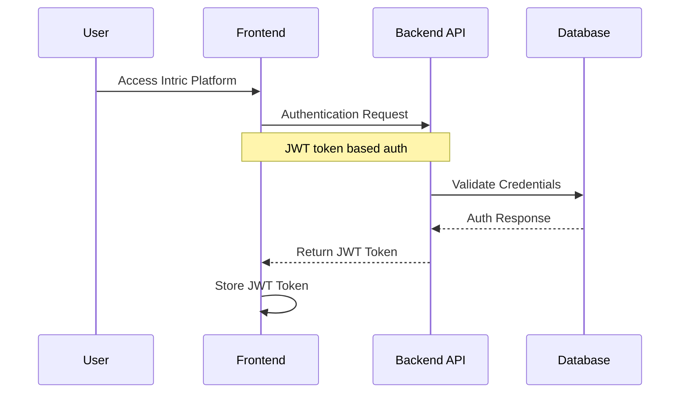
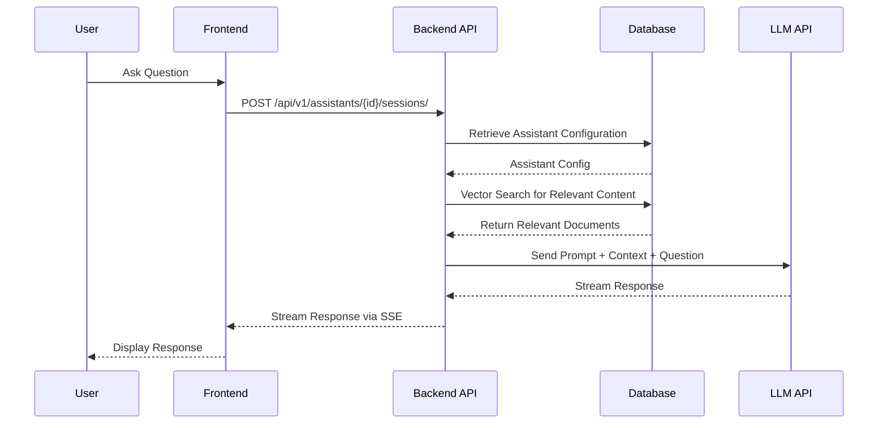
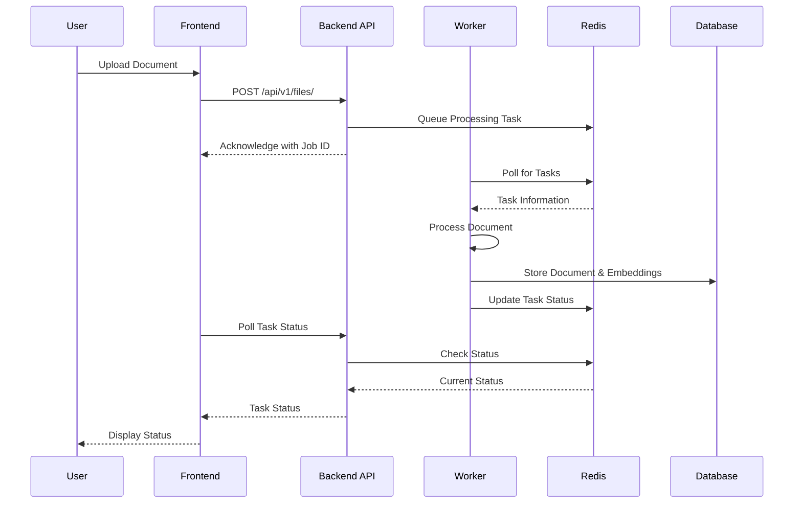

# Intric Architecture

This document provides a comprehensive overview of the Intric platform architecture, explaining how different components interact and the design principles behind the system.

## Table of Contents
- [Architecture Overview](#architecture-overview)
- [System Components](#system-components)
- [Data Flow](#data-flow)
- [Key Subsystems](#key-subsystems)
- [Security Architecture](#security-architecture)
- [Scaling Considerations](#scaling-considerations)
- [Design Principles](#design-principles)

## Architecture Overview

Intric employs a microservices architecture that separates concerns into distinct components while maintaining a cohesive system. The platform is designed to be:

- **Modular**: Each component has well-defined responsibilities
- **Scalable**: Components can be scaled independently
- **Resilient**: The system can continue operating despite partial failures
- **Secure**: Multi-layered security approach protects data and communications
- **Extensible**: New capabilities can be added without significant architectural changes

## System Components

The Intric platform consists of these primary components:

```
┌─────────────┐     ┌─────────────┐     ┌─────────────┐
│   Frontend  │────▶│  Backend    │────▶│  Database   │
│   (Nginx)   │◀────│  (FastAPI)  │◀────│ (PostgreSQL)│
└─────────────┘     └─────────────┘     └─────────────┘
                         │  ▲
                         │  │
                         ▼  │
                    ┌─────────────┐     ┌─────────────┐
                    │   Worker    │────▶│    Redis    │
                    │             │◀────│             │
                    └─────────────┘     └─────────────┘
```

### Frontend Service
- **Technology**: SvelteKit application served by Nginx
- **Responsibility**: Delivers the user interface and manages client-side state
- **Key Features**: 
  - Responsive UI components
  - Client-side routing
  - State management
  - Real-time updates via Server-Sent Events (SSE)

### Backend API
- **Technology**: FastAPI application
- **Responsibility**: Processes requests, implements business logic, manages authentication
- **Key Features**:
  - RESTful API endpoints
  - JWT authentication
  - Request validation
  - Business logic coordination
  - LLM integration

### Worker Service
- **Technology**: Python service using ARQ task queue
- **Responsibility**: Handles long-running background tasks
- **Key Features**:
  - Document processing
  - Website crawling
  - Vector embedding generation
  - Asynchronous processing

### Database
- **Technology**: PostgreSQL with pgvector extension
- **Responsibility**: Persistent storage for structured data and vector embeddings
- **Key Features**:
  - Relational data storage
  - Vector similarity search
  - ACID transactions
  - Data integrity

### Message Broker
- **Technology**: Redis
- **Responsibility**: Task queuing, caching, and pub/sub messaging
- **Key Features**:
  - Task queue for background jobs
  - Caching layer
  - Real-time event publishing
  - Temporary data storage

## Data Flow

### Authentication Flow



### Chat Interaction Flow



### Document Processing Flow



## Key Subsystems

### Knowledge Base Management
- **Purpose**: Manages different sources of knowledge that AI can reference
- **Components**:
  - Document processor
  - Web crawler
  - Embeddings generator
  - Vector search engine

### Assistant Configuration
- **Purpose**: Allows creation and customization of AI assistants
- **Components**:
  - Prompt templates
  - Knowledge source management
  - LLM configuration
  - Behavior settings

### Conversation Management
- **Purpose**: Handles chat interactions between users and AI assistants
- **Components**:
  - Session management
  - Context window management
  - Response generation
  - Streaming implementation

### Space Management
- **Purpose**: Provides collaborative workspaces for teams
- **Components**:
  - Access control
  - Resource sharing
  - Collaboration tools

## Security Architecture

Intric implements a multi-layered security approach:

### Authentication
- JWT-based authentication
- Optional integration with MobilityGuard for OIDC
- API key authentication for programmatic access

### Authorization
- Role-based access control (RBAC)
- Resource-level permissions
- Space-based isolation

### Data Protection
- Encrypted data in transit (TLS/SSL)
- Secure handling of sensitive information
- No persistent storage of LLM API keys in database

### API Security
- Input validation and sanitization
- Rate limiting
- CSRF protection
- Security headers

## Scaling Considerations

Intric is designed to scale in various ways:

### Horizontal Scaling
- Frontend can be load-balanced across multiple instances
- Worker services can be scaled to handle increased background processing
- Multiple backend instances can run behind a load balancer

### Database Scaling
- Connection pooling for efficient resource utilization
- Separate read replicas for high-read scenarios
- Proper indexing for query optimization

### Caching Strategy
- Response caching for frequent queries
- Session data caching
- Distributed caching with Redis

## Design Principles

Intric follows these key design principles:

### Domain-Driven Design
- Bounded contexts for different feature areas
- Entities and value objects that model the domain
- Repositories for data access abstraction
- Domain services for business logic

### Clean Architecture
- Separation of concerns
- Dependency inversion
- Use cases that encapsulate business rules
- Framework independence for core business logic

### API-First Design
- Well-defined API contracts
- Consistent API patterns
- Comprehensive documentation
- Versioning strategy

### Observability
- Structured logging
- Performance metrics collection
- Error tracking
- Audit trails for sensitive operations

### Extensibility
- Plugin architecture for LLM providers
- Service interfaces for component replacement
- Extension points for custom functionality
- Configuration-driven behavior
